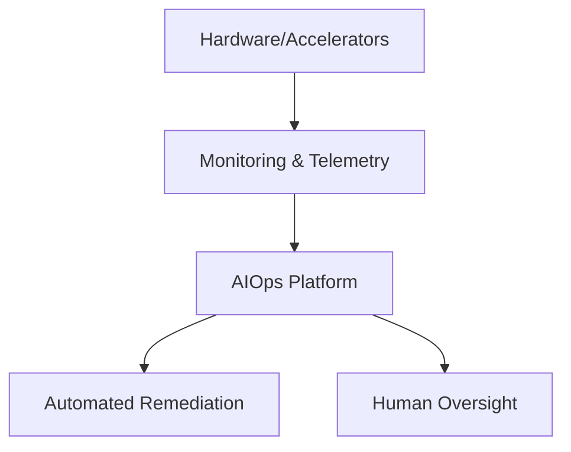

# Operational Management and Efficiency

> Managing data center operations effectively is paramount for both traditional and AI facilities, but the unique characteristics of AI infrastructure introduce distinct challenges and necessitate different approaches, particularly in monitoring, reliability, and energy efficiency.

## A. Monitoring and Observability: Traditional vs. AI-Specific Needs

- **Traditional Data Centers:**
  - Monitor CPU, memory, disk I/O, network, power, and environment (temperature, humidity)
  - Use APM tools for application response times and errors
  - Log management for troubleshooting
- **AI Data Centers:**
  - **Specialized Hardware Monitoring:**
    - Track GPU/TPU utilization, HBM usage/bandwidth, die temperature, per-accelerator power, interconnect status (NVLink, InfiniBand)
    - Tools like LogicMonitor expand to cover AI hardware
  - **AI Workload Monitoring:**
    - Monitor training progress (loss, accuracy), inference latency/throughput, model drift, data pipeline integrity
  - **AIOps Platforms:**
    - Use AI/ML to analyze massive telemetry (metrics, events, logs, traces)
    - Correlate events, detect anomalies, predict issues, automate root cause analysis/remediation
    - Leading providers: Dynatrace, LogicMonitor, Broadcom, OpenText, OpsRamp
  - **Context and Topology:**
    - Automated discovery and topology mapping (e.g., Dynatrace Smartscape)
    - Visualize dependencies for accurate analysis

:::info
A diagram here could show the AI operations stack: Hardware/Accelerators → Monitoring → AIOps → Automated Remediation
:::

> "Modern observability platforms emphasize automated discovery and topology mapping to understand complex interdependencies in distributed AI systems."

---

## B. Fault Tolerance, Reliability, and Maintenance Challenges

- **Traditional:**
  - Reliability via component/subsystem redundancy (N+1, 2N)
  - Scheduled maintenance windows, backup/disaster recovery
- **AI Data Centers:**
  - **Statistical Certainty of Failure:** With tens of thousands of GPUs, failures are expected
  - **Tightly Coupled Training:** Failure of a single component can halt a multi-million dollar job
  - **Rapid Fault Recovery:**
    - Hot spare nodes, automated detection/isolation, memory reconstruction via RDMA
    - Faster than restarting from checkpoint
  - **Frequent Checkpointing:**
    - Regularly save model state to persistent storage (local NVMe or networked)
    - Checkpointing impacts efficiency (Model FLOP Utilization)
  - **Specialized Cluster Management Software:**
    - Health, scheduling, optimization, and fault recovery for massive systems
  - **Liquid Cooling Maintenance:**
    - Monitor/treat coolant quality, leak detection, maintain pumps/CDUs/heat exchangers, train staff

:::tip
Best practice: Focus on minimizing the *impact* of failures, not just preventing them. Rapid state recovery and dynamic fault isolation are critical for large AI clusters.
:::

> "The synchronous nature of large-scale AI training means the failure of a single GPU or network link can halt the entire cluster."

---

## C. Energy Efficiency and Sustainability Efforts

- **Traditional:**
  - Improve PUE via airflow management, efficient UPS, free cooling, renewables
- **AI Data Centers:**
  - **PUE Optimization with Liquid Cooling:**
    - Higher water temps enable more free cooling, less reliance on chillers
    - PUE values can approach 1.1 or lower
  - **Hardware Efficiency:**
    - Newer GPUs/TPUs deliver more performance per watt
  - **Software/Algorithmic Optimization:**
    - Efficient model architectures and software stacks reduce total computation
  - **Waste Heat Reuse:**
    - Liquid cooling enables heat reuse for buildings/industry
  - **Renewable/Low-Carbon Power:**
    - Prioritize locations with access to renewables or nuclear
    - Some co-locate near power generation or invest in renewables

:::info
AIOps and automation are essential for managing the scale and complexity of modern AI data centers, enabling real-time anomaly detection, prediction, and remediation.
:::

---

## D. Paradigm Shifts in Operations

- **From Human-Centric to Autonomous Operations:**
  - Scale and complexity require AI-driven automation (AIOps)
  - Human capacity is insufficient for real-time analysis/intervention
- **From Component Redundancy to System-Level Fault Tolerance:**
  - Focus on minimizing impact of failures, not just prevention
  - Treat the cluster as a single, fault-tolerant supercomputing system

### AI Operations Stack Diagram

*Figure: The AI operations stack from hardware to automated remediation and human oversight.*

---

## Key Takeaways

- AI data centers require specialized monitoring, AIOps, and rapid fault recovery
- Reliability strategies must focus on minimizing the impact of inevitable failures
- Energy efficiency and sustainability are critical operational imperatives
- Automation and system-level thinking are essential for managing scale and complexity