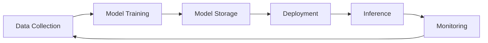

# Security and Compliance Landscape

> While sharing many security concerns with traditional data centers, AI facilities face a unique set of risks targeting the machine learning models and pipelines themselves, demanding expanded security postures and compliance considerations.

## A. Unique AI Security Risks and Mitigation

- **Data Poisoning:** Attackers corrupt training data to skew predictions, degrade performance, or introduce backdoors.
  - *Mitigation:* Rigorous data validation, continuous monitoring, diverse datasets, data provenance, adversarial training.
- **Model Theft / Extraction:** Stealing trained models or inferring sensitive training data via API queries.
  - *Mitigation:* Encryption at rest/in transit, strong access controls, API rate limiting, usage monitoring, model watermarking.
- **Adversarial Attacks (Evasion):** Subtle input perturbations cause incorrect predictions or bypass security systems.
  - *Mitigation:* Adversarial training, input validation, robust preprocessing, output limitation, robustness testing.
- **Resource Jacking:** Unauthorized use of AI infrastructure (e.g., GPU hijacking for crypto mining).
  - *Mitigation:* Strict access controls, resource monitoring, anomaly alerts.
- **Supply Chain Risks:** Vulnerabilities in third-party datasets, models, libraries, or frameworks.
  - *Mitigation:* Vetting sources, security scanning, SSDLC, supply chain mapping and monitoring.
- **Privacy Leakage:** Models inadvertently memorize and reveal sensitive training data.
  - *Mitigation:* Differential privacy, data anonymization, secure aggregation, output evaluation.

:::warning
AI security must address threats across the entire ML lifecycle, not just infrastructure endpoints.
:::

---

## B. Comparison with Traditional Data Center Security Concerns

- **Both require:**
  - Physical security (access controls, surveillance, secure design)
  - Network security (firewalls, IDS/IPS)
  - Data encryption (at rest and in transit)
  - Vulnerability scanning, patch management
  - Disaster recovery and business continuity
- **AI introduces:**
  - New attack surfaces (data, models, pipelines)
  - Focus on protecting the ML lifecycle, not just infrastructure
  - Threats include subtle manipulation of model logic (e.g., data poisoning, adversarial examples)

> "AI security must extend protection to the entire ML lifecycle, treating data, models, and pipelines as critical assets with unique vulnerabilities."

---

## C. Compliance Considerations in AI Environments

- **Data Privacy:**
  - Regulations (GDPR, HIPAA) require strict handling of personal/sensitive data
  - Techniques: anonymization, consent management, secure data handling
- **Data Sovereignty:**
  - Laws may require data to be stored/processed within national borders
  - Impacts facility location and infrastructure choices
- **Ethical AI and Bias:**
  - Pressure for fairness, transparency, and accountability
  - Addressing bias, explainability, and robust governance frameworks
- **General Security Standards:**
  - Adherence to standards like ISO 27001 for baseline security management

:::info
A diagram here could show the AI security lifecycle: Data Collection → Model Training → Model Storage → Deployment → Inference → Monitoring.
:::

---

## D. Evolving Security Posture for AI Data Centers

- Security controls must "shift left" (into data prep/model dev) and "shift right" (into deployment/inference monitoring)
- Protect the integrity of the entire MLOps lifecycle
- Validate training data as rigorously as production code
- Treat models as sensitive IP
- Harden inference against manipulation
- Track data provenance and monitor for anomalous model behavior
- Use explainable AI (XAI) for security forensics

> "The opaque nature of deep learning models makes security auditing and incident response uniquely challenging."

### AI Security Lifecycle Diagram

*Figure: The AI security lifecycle from data collection to monitoring.*

---

## Key Takeaways

- AI data centers face unique security risks targeting the ML lifecycle
- Security must extend beyond infrastructure to data, models, and pipelines
- Compliance and governance are increasingly complex and critical
- Continuous monitoring, data provenance, and explainable AI are essential for robust security