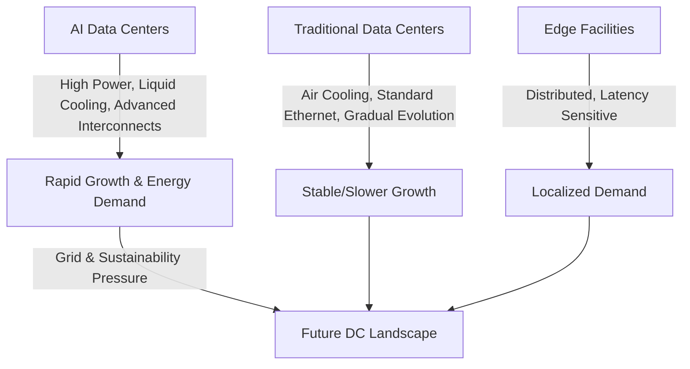

# Economics, Trends, and Future Outlook

> The data center landscape is evolving rapidly, driven by AI demands and the quest for efficiency, automation, and sustainability. The next decade will see a growing divergence between AI-focused and traditional data centers.

## A. AI-Driven Data Center Automation and Self-Optimization (AIOps Evolution)

- **Current State:**
  - AIOps platforms ingest vast telemetry (metrics, events, logs, traces)
  - Use ML for analytics (anomaly detection, event correlation, root cause analysis)
  - Automate alerting and some remediation workflows
- **Future Trajectory:**
  - *Predictive Maintenance:* AI predicts failures and schedules maintenance
  - *Self-Healing Systems:* AI diagnoses and remediates issues automatically
  - *Intelligent Resource Optimization:* AI optimizes workload placement, power, and cooling in real time
  - *Hyperautomation:* Extends automation to capacity planning, security, and compliance

:::info
AIOps is moving from analytics and alerting to full autonomy, enabling self-optimizing, self-healing data centers.
:::

---

## B. Predicted Divergence: The Next 5-10 Years

- **AI as Growth Engine:**
  - AI workloads will drive most new data center capacity and energy demand
  - Power demand could nearly double from 2023 to 2026, with AI's share rising from 14% to 27%
- **Traditional DC Evolution:**
  - Will continue to host enterprise/cloud workloads, but grow more slowly
  - Infrastructure will evolve less rapidly than AI facilities
- **Infrastructure Bifurcation:**
  - AI DCs: Liquid cooling, high rack densities, advanced interconnects, power-centric site selection
  - Traditional DCs: Optimized air cooling, standard Ethernet, slower evolution
- **AI Workload Shift:**
  - Inference will eventually surpass training as the dominant AI workload
  - May drive more distributed, edge-like AI infrastructure

:::info
A diagram here could show the divergence of AI vs. traditional data centers and the projected energy demand growth.
:::

> "The technological gap between AI and traditional data centers will widen, with AI facilities pushing the limits of power, cooling, and interconnects."

---

## C. Long-Term Energy Demand and Sustainability Challenges

- **Massive Energy Demand:**
  - Data centers could consume 4.5% of global electricity by 2030 (Semianalysis)
  - AI is the primary driver of this surge
- **Grid Strain & Investment:**
  - Up to $720B in grid upgrades may be needed in the US by 2030
  - Grid bottlenecks could limit data center expansion
- **Sustainability Imperative:**
  - Operators must source renewables, maximize efficiency, and reuse waste heat
  - Corporate sustainability goals will accelerate these trends

:::warning
The scale of AI-driven energy demand will require unprecedented investment in grid infrastructure and renewables.
:::

---

## Future Power Demand Forecast Table

| Source | Metric | Forecast Year(s) | Value / Projection | Key Assumptions/Notes |
| :---- | :---- | :---- | :---- | :---- |
| **Semianalysis** | Global DC Critical IT Power | 2023 | 49 GW | Baseline estimate |
| **Semianalysis** | Global DC Critical IT Power | 2026 | 96 GW | 25% CAGR, AI ~40 GW |
| **Semianalysis** | Global DC % of Energy Generation | 2030 | 4.5% | AI propels DC share |
| **IEA (via Semianalysis)** | AI DC Power Demand (TWh) | 2026 | 90 TWh | ~10 GW IT Power |
| **Deloitte** | Global DC Electricity (TWh) | 2025 | 536 TWh (~2% global) | Baseline |
| **Deloitte** | Global DC Electricity (TWh) | 2030 | ~1,000 TWh (>1,300 if efficiency lags) | |
| **Deloitte** | Global DC Critical IT Power | 2026 | 96 GW | Corroborates Semianalysis |
| **Deloitte** | AI DC Annual Power (TWh) | 2026 | 90 TWh (~1/7th of total) | Tenfold increase from 2022 |
| **Goldman Sachs** | Global DC Power Demand Increase | 2027 vs 2023 | +50% | Baseline |
| **Goldman Sachs** | Global DC Power Demand Increase | 2030 vs 2023 | Up to +165% | Baseline |
| **Goldman Sachs** | Global DC Power Demand (GW) | 2023/24 | ~55 GW | Cloud 54%, Trad. 32%, AI 14% |
| **Goldman Sachs** | Global DC Power Demand (GW) | 2027 | 84 GW | Cloud 50%, Trad. 23%, AI 27% |
| **Goldman Sachs** | Global DC Capacity Online (GW) | End 2030 | ~122 GW | Total available |
| **JLL** | Global DC Market Growth (CAGR) | 2025-2027 | 15-20% | Construction pipeline |
| **JLL** | AI Share of DC Demand | 2030 | &lt;50% | Traditional still majority |

---

## D. Outlook: Symbiosis and Specialization

> The future data center landscape will feature highly specialized "AI factories" alongside more distributed traditional and edge facilities. Massive, centralized AI campuses will push the limits of power, cooling, and interconnects, while traditional DCs evolve more gradually.

### Data Center Divergence & Energy Demand Diagram

*Figure: Projected divergence and energy demand in the future data center landscape.*

---

## Key Takeaways

- AI is the primary driver of new data center capacity and energy demand
- The gap between AI and traditional data centers will widen in technology and operations
- Energy demand and sustainability are critical challenges for the next decade
- Operators must invest in automation, efficiency, and renewable energy to remain competitive