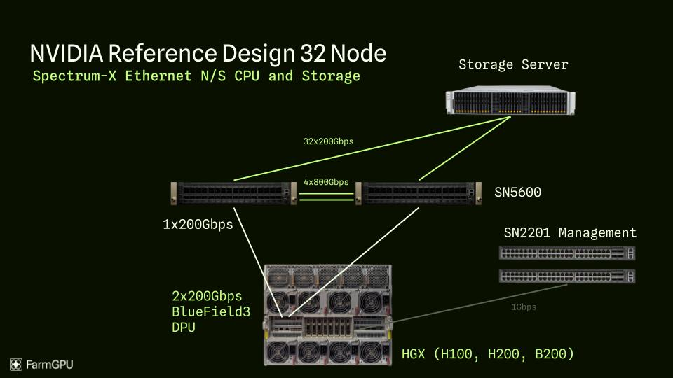

# Networking Technology in AI Data Centers

> The choice of networking fabric is a critical differentiator for AI data centers, impacting performance, scalability, and cost.

## Networking Technology Comparison

| Technology | Key Characteristics | Primary Use Case (AI DC) | Pros | Cons |
| :---- | :---- | :---- | :---- | :---- |
| **Standard Ethernet (≤100G)** | Ubiquitous, best-effort delivery, mature ecosystem, lower speeds | Frontend network, management, traditional workloads | Cost-effective, widely understood, interoperable | High latency, not lossless (unsuitable for RDMA/AI collectives without significant modification) |
| **InfiniBand (IB)** | High bandwidth (400G/800G+), low latency, lossless fabric, native RDMA support | AI training backend fabric (Scale-Out) | Proven performance for HPC/AI, efficient RDMA, mature ecosystem for HPC | Potential scaling limits, higher cost, vendor concentration (NVIDIA/Mellanox), separate network |
| **Ethernet with RoCE (e.g., Spectrum-X)** | High bandwidth (400G/800G+), RDMA over Ethernet, requires lossless configuration (PFC/ECN) | AI training/inference backend fabric (Scale-Out) | Leverages Ethernet ecosystem, potential cost savings, supplier diversity, better integration potential | Requires careful configuration for losslessness, performance potentially sensitive to network tuning |
| **Scale-Up Fabric (NVLink/ICI/NeuronLink)** | Extremely high bandwidth (TB/s aggregate), ultra-low latency, proprietary, short reach | Intra-server/intra-node accelerator interconnect (Scale-Up) | Enables fine-grained parallelism (e.g., tensor parallelism), maximizes accelerator utilization | Proprietary, limited distance, adds complexity/cost |

---

## Visualizing AI Data Center Networking

*Figure: North/South (NS) network traffic in a data center, typically representing traffic between external clients and internal servers.*

*Figure: East/West (EW) network traffic in a data center, representing traffic between servers or racks within the data center, crucial for distributed AI workloads.*

---

## System-Level Optimization

:::info
AI data centers foster a much tighter coupling between accelerators, memory, and interconnect compared to traditional, modular server designs.
:::

- Traditional servers allow flexible mixing of CPUs, DRAM, NICs, and storage.
- AI servers require balanced throughput across the entire data path (HBM → accelerator → interconnect).
- Bottlenecks in memory or networking can leave expensive compute units underutilized.
- System-level co-design is emphasized (e.g., NVIDIA DGX, Google TPU pods, AWS Trainium servers).

> "AI server design increasingly emphasizes system-level optimization and co-design, contrasting sharply with the component-level modularity of traditional servers."

---

## Economic Impact of Networking Choices

- Shift from general-purpose CPUs to specialized accelerators reshapes the data center value chain.
- In high-end AI servers, accelerators dominate the cost structure; DRAM is a much smaller fraction.
- Suppliers of HBM and high-speed interconnects gain importance; traditional CPU/DRAM vendors see relative decline.
- Networking technology choice (InfiniBand vs. RoCE) impacts both performance and economics.

:::tip
The ongoing competition between InfiniBand and high-speed Ethernet (RoCE) is driving innovation and providing customers with more choices for large-scale AI deployments.
:::

> "Ethernet's ubiquity and cost base make it attractive for hyperscalers, while InfiniBand's low-latency, lossless design remains proven for tightly coupled AI workloads."

---

## Key Takeaways

- AI data centers require specialized, high-bandwidth, low-latency networking fabrics.
- System-level co-design is critical for maximizing accelerator utilization.
- The choice between InfiniBand and RoCE is a major architectural and economic decision.
- Networking innovation is accelerating as AI workloads scale up.