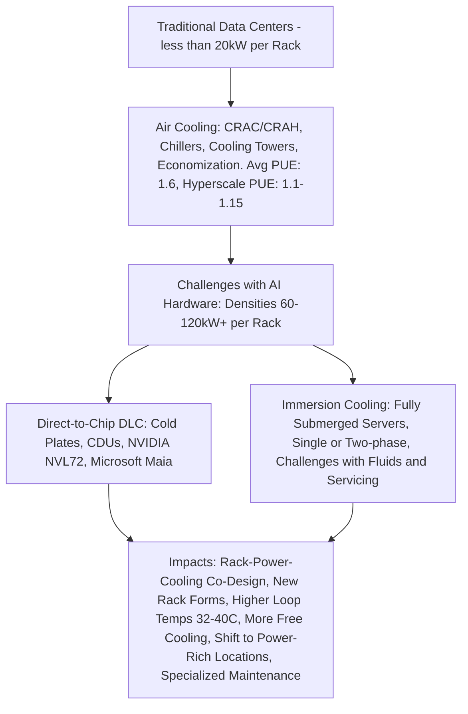

# Data Center Cooling Evolution for AI

Below is a flowchart illustrating the evolution from traditional data center cooling to advanced solutions for AI hardware:

# Cooling

The immense heat generated by densely packed AI accelerators renders traditional **air‑cooling** increasingly inadequate. While air‑cooling (CRACs/CRAHs, chillers, cooling towers, economizers) remains viable below **≈ 20 kW/rack**, it struggles to cope with AI loads. The industry‑average **PUE** for air‑cooled facilities sits near **1.6**, although tuned hyperscale designs hit **1.1 – 1.15**.

For AI‑centric facilities the transition to **liquid cooling** is rapidly becoming mandatory.

## 1. Liquid‑Cooling Methods

### 1.1 Direct‑to‑Chip (DLC)

Circulates coolant through cold‑plates mounted directly on GPUs/CPUs. Heat is removed to a facility loop via **CDUs**. DLC already ships with NVIDIA’s **120 kW NVL72** racks and Microsoft’s **Maia** systems.

### 1.2 Immersion Cooling

Servers are submerged in dielectric fluid — single‑phase (liquid only) or two‑phase (boiling + condensation). Efficiency is high but servicing, material compatibility and cost remain barriers; OCP is driving standards.

## 2. Why Liquid Wins at Scale

* **Higher allowable water temps** (≥ 32 °C, often 40 °C) enable free cooling and heat reuse.
* **Pumps replace fans** — removing 5 – 10  % rack power.
* **Density** — 50 – 120 kW/rack today; >150 kW in roadmap.
* **Chiller‑less topologies** slash mechanical complexity and sometimes water use to zero.

## 3. Design Consequences

* **Holistic co‑design** of rack, power and cooling; manifolds and CDUs live inside or beside the rack.
* **Non‑standard form factors** (e.g., Microsoft *Ares* rack) become common.
* **Retrofits** over ~25 kW/rack typically require full mechanical rebuilds; greenfield liquid beats incremental upgrades.
* **Site selection pivots** to cheap, abundant, reliable power (hydro, nuclear, large renewables) — often away from network hubs.

## 4. Operations Shift

* Coolant quality management (pH, conductivity, biocides).
* Leak detection & containment are mission‑critical.
* New maintenance playbooks for pumps, plates, manifolds, CDUs; immersion adds fluid‑handling SOPs.
* Faster thermal run‑away demands improved monitoring & controls.

---

# Cooling: Traditional vs AI‑Optimised Datacentres

|                       | **Legacy (2010‑2022)** | **AI‑Centric (2024‑2027)** |
|-----------------------|-------------------------|----------------------------|
| **Rack power**        | 5 – 20 kW              | 50 – 120 kW (NVL72)        |
| **Primary method**    | Room‑level air cooling | DLC; immersion (niche)     |
| **Heat rejection**    | Chillers + Towers      | Warm‑water → dry/adiabatic |
| **PUE add‑on**        | 0.4 – 0.6 W/W          | ≤ 0.15 W/W                 |
| **Water usage (WUE)** | 1 – 3 L/kWh            | 0 – 0.2 L/kWh              |
| **Upgrade ceiling**   | ~30 kW/rack            | >120 kW/rack roadmap       |

### Key Takeaways

1. *Long air paths = wasted energy*; liquid captures heat at the source.
2. DLC shifts efficiency gains to the IT side by killing server‑fan power.
3. Warm‑water loops enable **100 % free cooling in > 80 %** of climates.
4. Immersion will remain a specialty tool; DLC is the mainstream for this GPU cycle.

> **One‑sentence takeaway:** *Air‑cooled rooms optimised for 10 kW racks can't keep up with AI's 100 kW monsters; warm‑water DLC delivers order‑of‑magnitude density, double‑digit energy savings and zero water — the new default for GPU datacentres.*

