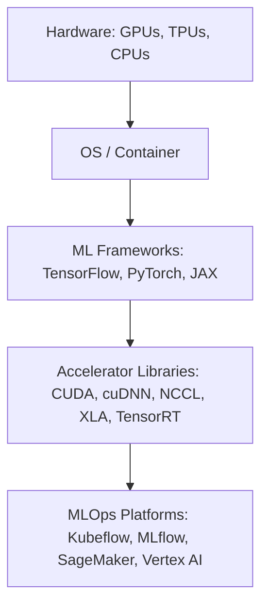
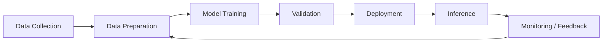

# Workload Characteristics and Software Ecosystems

> The divergence between traditional and AI data centers extends deeply into the types of computational tasks performed and the software ecosystems that support them.

## A. Computational Task Differentiation

:::info
**Traditional Data Centers:**
:::
- Host a wide variety of workloads:
  - Transactional processing (financial systems, e-commerce)
  - Web serving
  - Database management (relational and NoSQL)
  - Virtual desktop infrastructure (VDI)
  - Email services
  - General enterprise applications
  - Large-scale batch processing jobs
- Workloads are often:
  - I/O bound (storage/network speed limited)
  - Moderately CPU-bound
  - Bursty or unpredictable in traffic patterns

:::tip
**AI-Focused Data Centers:**
:::
- Geared towards compute-bound tasks with massive parallelism
- Two main categories:
  - **AI Training:**
    - Processes colossal, often unstructured datasets (images, video, audio, text)
    - Jobs can run for weeks/months, requiring sustained high throughput across thousands of accelerators
    - Uses parallelism strategies (data, tensor, pipeline)
    - Less sensitive to network latency, but highly dependent on bandwidth and interconnect topology
  - **AI Inference:**
    - Uses pre-trained models to make predictions on new data
    - Can be batch (throughput-focused) or real-time (latency-critical)
    - May run in centralized data centers or at the edge

> "AI training is compute-intensive and bandwidth-hungry, while inference can be either throughput- or latency-driven depending on the application."

---

## B. Software Stacks: Specialized AI Frameworks vs. Enterprise Applications

- **Traditional Data Centers:**
  - Standard OS (Linux, Windows Server)
  - Relational/NoSQL databases (PostgreSQL, MySQL, MongoDB)
  - Web servers (Apache, Nginx), middleware, enterprise apps (SAP, Oracle)
  - Virtualization management (VMware vSphere, KVM)
- **AI Data Centers:**
  - **ML Frameworks:** TensorFlow, PyTorch, JAX
  - **Accelerator Libraries:** NVIDIA CUDA, cuDNN, NCCL; Google XLA; NVIDIA TensorRT
  - **MLOps Platforms:** Kubeflow, MLflow, AWS SageMaker, Azure ML, Google Vertex AI

### AI Software Stack Diagram

*Figure: The AI software stack from hardware to MLOps platforms.*

---

## C. Virtualization and Containerization Strategies

- **Traditional:**
  - Heavy use of hypervisors (VMware ESXi, Hyper-V, KVM)
  - VMs for isolation, consolidation, flexibility
  - Containers (Docker) often run within VMs for microservices
- **AI-Focused:**
  - **Bare Metal:** Preferred for max performance in training
  - **VMs:** Used for isolation, but can add overhead
  - **Containers:** Ubiquitous for packaging AI apps, dependencies, and for reproducibility (Kubernetes is standard for orchestration)
  - Often a hybrid: containers on bare metal or within VMs, depending on needs

:::tip
**Best Practice:**
For large-scale AI training, run containers directly on bare metal to maximize accelerator utilization and minimize overhead.
:::

> "The choice between bare metal, VMs, and containers is driven by performance, isolation, and management needs—often resulting in hybrid approaches."

---

## D. Orchestration and Resource Management

- **Traditional:**
  - VM management (vCenter, OpenStack)
  - Configuration management (Ansible, Chef, Puppet)
  - Basic container orchestration
- **AI Data Centers:**
  - Heavy use of Kubernetes for large-scale, distributed, containerized workloads
  - Kubernetes features:
    - Deployment, scaling, networking, lifecycle management
    - GPU scheduling and management (device plugins, time-slicing, MIG)
    - Intelligent placement algorithms (bin-packing, Volcano)
    - Autoscaling (HPA, VPA, Cluster Autoscaler)
  - Other orchestration tools: HashiCorp Nomad, Apache Mesos

### AI Workload Lifecycle Diagram

*Figure: The AI workload lifecycle from data collection to monitoring and feedback.*

> "Orchestrating complex distributed training jobs across thousands of GPUs, ensuring fault tolerance, and tracking experiments demands specialized tools and expertise beyond standard DevOps."

---

## Key Takeaways

- AI data centers are optimized for compute-bound, parallel workloads, while traditional centers handle a broader mix.
- The software stack in AI data centers is specialized and tightly integrated with hardware accelerators.
- Containerization and Kubernetes are essential for reproducibility and resource management in AI workflows.
- Orchestration and MLOps platforms are critical for managing the complexity and scale of modern AI development and deployment.

# VII. Deployment Models and Scalability

The ways in which AI infrastructure is deployed and scaled differ significantly based on organizational needs, budget, expertise, and the specific AI workloads being run. Options range from leveraging massive public cloud platforms to building private facilities or utilizing edge computing.

## A. Hyperscaler AI Offerings vs. Traditional Cloud Services

- **Traditional IaaS Cloud:**
  - General-purpose VMs, block/object storage, databases, standard networking
  - Scalable and flexible, but often lack specialized, high-performance hardware and optimized fabrics for AI
- **Hyperscaler AI Offerings (AWS, Azure, GCP):**
  - **Specialized Hardware Access:** On-demand fleets of latest-gen NVIDIA GPUs, custom AI accelerators (Google TPUs, AWS Trainium/Inferentia, Microsoft Maia)
  - **Managed AI Platforms:** PaaS solutions (SageMaker, Azure ML, Vertex AI) for the full ML lifecycle
  - **Scalable Infrastructure:** Massive scale, global reach, and huge ongoing investment
  - **Optimized Stacks:** Pre-configured environments, optimized drivers, integrated frameworks
- **Specialized AI Cloud Providers:** (e.g., CoreWeave, Lambda Labs)
  - Focus on high-performance GPU compute, custom infrastructure, and tailored pricing/models

:::info
A diagram here could show deployment models: Public Cloud ↔ Private DC ↔ Hybrid ↔ Edge
:::

> "Hyperscalers are investing hundreds of billions annually in AI-specific capacity, driving innovation and economies of scale that are hard for others to match."

---

## B. Private, Hybrid, and Colocation Models for AI

- **Private AI Data Center:**
  - Maximum control over hardware, software, security, and data governance
  - Potentially lower TCO for large, sustained workloads
  - Requires high CapEx, deep technical expertise, and long lead times
- **Hybrid AI:**
  - Combines private infrastructure with public cloud
  - Sensitive data/training in private, burst/scale/inference in public
  - Requires robust connectivity and sophisticated management tools
- **Colocation for AI:**
  - Rent space, power, cooling, and network in a third-party facility
  - Customer manages their own hardware
  - Colocation providers are adapting for high-density, liquid-cooled AI hardware
  - Middle ground between fully private and fully public cloud

> "Notably, hyperscalers themselves are often major tenants in colocation facilities to supplement their own buildouts."

---

## C. Edge AI Deployments: Use Cases and Challenges

- **Edge AI:** Decentralized model where inference occurs closer to the data source (on devices or local edge servers)
- **Benefits:**
  - *Reduced Latency:* Real-time responses for autonomous driving, robotics, AR/VR
  - *Enhanced Privacy/Security:* Local processing reduces data exposure
  - *Bandwidth Savings:* Less data sent to the cloud
  - *Improved Reliability:* Works even with intermittent connectivity
- **Challenges:**
  - *Resource Constraints:* Limited compute, memory, and power at the edge
  - *Environmental Factors:* Harsh conditions (temp, humidity, vibration)
  - *Management Complexity:* Deploying, updating, and monitoring thousands/millions of devices
  - *Integration:* Legacy systems, diverse hardware
  - *Security:* Physical and cyber threats
- **Use Cases:**
  - Smart cities, autonomous vehicles, industrial IoT, smart retail, healthcare, consumer electronics, content delivery

:::tip
Edge AI is a counter-trend to centralization, enabling low-latency, privacy-preserving, and resilient AI applications at the network edge.
:::

---

## Economic Realities and Market Trends

- Building state-of-the-art AI training facilities requires enormous capital investment (billions for a single large GPU cluster)
- Hyperscalers leverage scale for better pricing, custom silicon, and R&D
- Private AI DCs can offer TCO advantages for sustained workloads, but high CapEx and expertise needs are a barrier
- Specialized providers (e.g., CoreWeave) and edge AI are creating new market opportunities

> "The rise of edge AI represents a significant counter-trend to the massive centralization occurring for large-scale training."

---

## Key Takeaways

- AI deployment models range from public cloud to private, hybrid, colocation, and edge
- Hyperscalers dominate large-scale AI due to capital, scale, and innovation
- Edge AI is growing for latency, privacy, and reliability needs
- Economic and operational realities shape the choice of deployment model